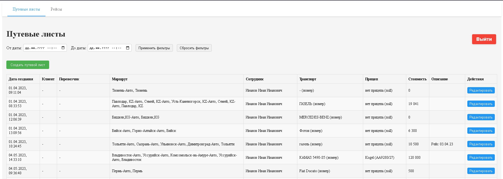
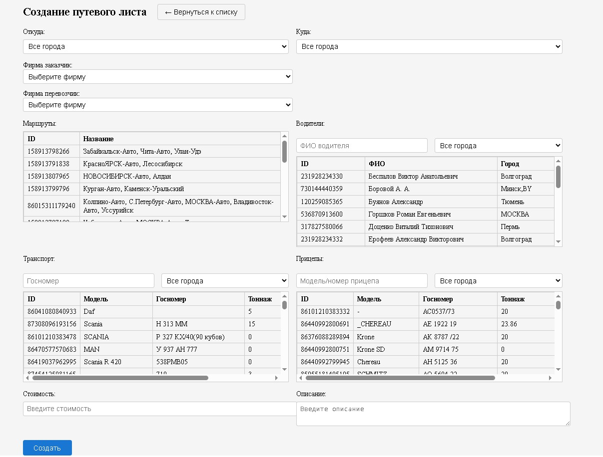
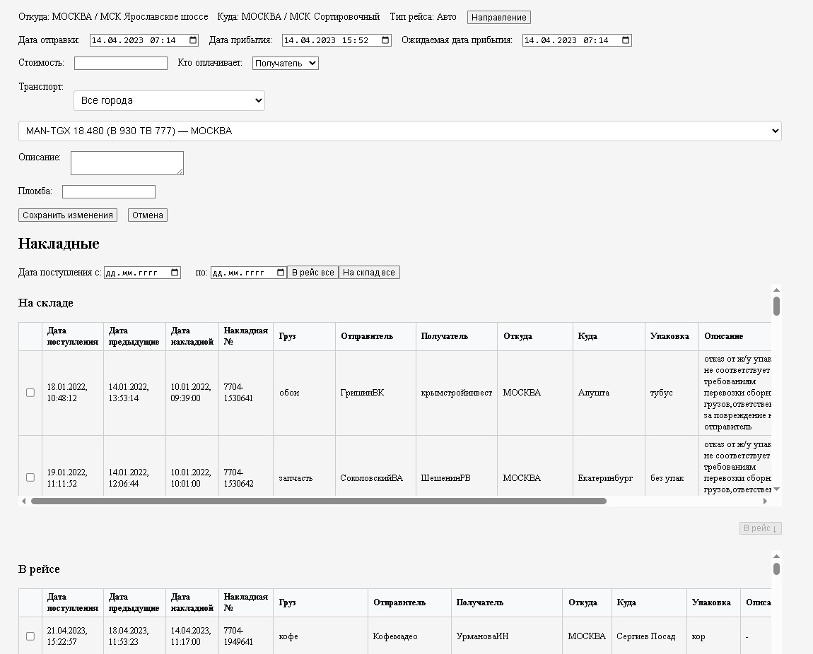

# Transport Company Web Application

> 🎓 Дипломный проект: веб-приложение для автоматизации работы транспортной компании.

## 📌 Описание

Приложение предназначено для автоматизации ключевых процессов транспортной компании, включая:
- управление рейсами и складами;
- работу с накладными;
- авторизацию пользователей.

Проект включает как клиентскую, так и серверную часть.

## 🧰 Технологии

### Backend
- Kotlin + Spring Boot
- PostgreSQL
- Spring Security (JWT авторизация)
- REST API
- Spring Cloud OpenFeign

### Frontend
- React + TypeScript
- Axios
- React Router
- Vite

## 🚀 Запуск (ограниченный)

> ⚠️ **Примечание:** приложение работает с внутренней базой данных, доступ к которой осуществляется только через VPN. Полноценный запуск возможен только в корпоративной среде.

Тем не менее, структура проекта позволяет адаптировать его под любую базу данных. Все репозитории и сервисы абстрагированы.

## 🛠 Переменные окружения

Проект использует переменные окружения на backend и frontend.

### Backend (backend/.env)

Создайте файл `.env` на основе `.env.example` и укажите свои значения:

```env
AUTH_CLIENT_URL=...
JWT_SECRET=...
DB_HOST=...
DB_PORT=...
DB_NAME=...
DB_USER=...
DB_PASS=...
```
### Frontend (frontend/.env)
Фронт использует токен для разработки:
```env
VITE_DEV_TOKEN=...
```
Создайте файл .env на основе .env.example и добавьте значение токена.
> Настоящие .env-файлы не включены в репозиторий по соображениям безопасности.

### 💻 Как запустить локально
Backend:
```bash
cd backend
./gradlew bootRun
```

Frontend:
```bash
cd frontend
npm install
npm run dev
```
Приложение будет доступно по адресу: http://localhost:5173
> ⚠️ Backend должен быть запущен и доступен по адресу http://localhost:8080

### 📷 Скриншоты

- **Авторизация**  
  

- **Список путевых листов**  
  

- **Создание путевого листа**  
  

- **Создание/редактирование рейса**  
  

  ## ✅ Возможности

- Аутентификация и авторизация
- Просмотр и редактирование рейсов
- Отображение и фильтрация накладных
- Прикрепление файлов к рейсам
- Работа со складами и маршрутами

## 🏗 Возможности для расширения

- Добавление поддержки Docker
- Возможность смены источника БД (например, локальной PostgreSQL)
- CI/CD для деплоя
- Улучшение UI/UX

## 👤 Автор

- Артём Посный — дипломный проект, 2025
- [GitHub](https://github.com/Tutuwaihai)
